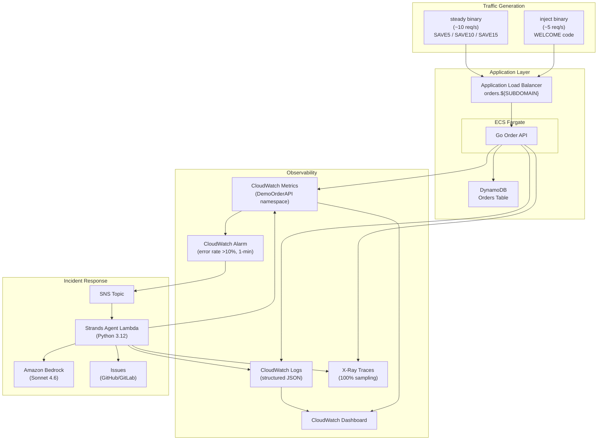
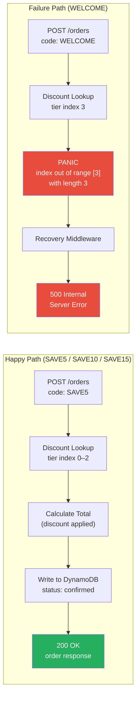
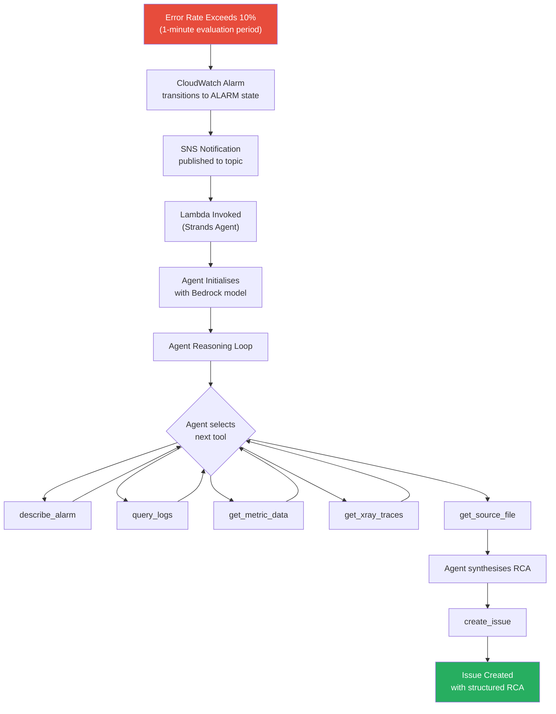
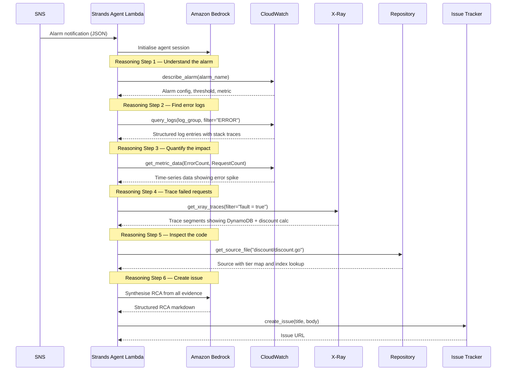

# Architecture

## System Overview

This project demonstrates end-to-end automated incident response on AWS. A Go order API running on ECS Fargate experiences a real failure — an index out of bounds panic triggered by a specific discount code — and AWS-native observability detects the resulting error spike. A Strands AI agent, running as a Python Lambda function, triages the incident automatically: it queries CloudWatch logs, metrics, and X-Ray traces, inspects the source code, and creates a GitHub issue containing a structured engineering root cause analysis (RCA).

The system comprises the following components:

| Component | Technology | Purpose |
|---|---|---|
| **Order API** | Go on ECS Fargate | Order processing service at `orders.${SUBDOMAIN}`, with an intentional bug |
| **DynamoDB** | On-demand table | Orders storage (partition key `id`, GSI `status-index`) |
| **Traffic Generator** | Two Go binaries | `steady` (happy-path codes at ~10 req/s) and `inject` (buggy code at ~5 req/s) |
| **CloudWatch** | Logs, Metrics, Alarms, Dashboard | Structured JSON logs, custom metrics, metric filters, error-rate alarm |
| **X-Ray** | Distributed tracing | Full request tracing including DynamoDB calls, 100% sampling for demo |
| **SNS** | Alarm notification topic | Bridges CloudWatch Alarms to the triage Lambda |
| **Strands Agent Lambda** | Python 3.12, container image | AI triage agent — 5-min timeout, 1024 MB memory, configurable Bedrock model (default Sonnet 4.6) |
| **Issue Tracker** | GitHub or GitLab | Receives structured RCA issues from the agent |

### System Architecture

### Data Flow — Happy Path vs Failure Path

### Incident Response Flow

### Agent Tool Sequence

## Key Design Decisions

| Decision | Choice | Rationale |
|---|---|---|
| **Compute** | ECS Fargate | No cluster management; right-sized for a single-service demo |
| **Data store** | DynamoDB (on-demand) | Zero provisioning, pay-per-request suits bursty demo traffic |
| **Observability** | CloudWatch-native (Logs, Metrics, Alarms, Dashboard) | Single pane of glass; no third-party tooling required |
| **Tracing** | AWS X-Ray at 100% sampling | Guaranteed trace capture for every demo request |
| **Agent framework** | Strands Agents SDK | Lightweight Python agent framework with native AWS tool integration |
| **Agent model** | Configurable via Bedrock (default Sonnet 4.6 until tested) | Swappable at deploy time; Bedrock avoids API key management |
| **Agent trigger** | CloudWatch Alarm → SNS → Lambda | Fully event-driven; no polling; standard AWS integration pattern |
| **Traffic generator** | Two Go binaries: `steady` and `inject` | Compiled binaries for minimal overhead; separate binaries give precise control over demo timing |
| **Frontend** | `go:embed` | Single binary ships static assets; no separate build step |
| **Demo reset** | `terraform destroy` / `terraform apply` | Clean-room reproducibility; entire stack rebuilt in minutes |

## The Bug

The order API contains a deliberate bug in the discount calculation logic. It is the centrepiece of the demo — **it must not be fixed**.

### How It Works

The discount system uses a two-level mapping:

1. **Promo code → tier index**: A map associates each discount code with a numeric tier.
2. **Tier index → discount percentage**: A slice of tiers defines the actual discount values.

The valid codes and their mappings are:

| Code | Tier Index | Discount |
|---|---|---|
| `SAVE5` | 0 | 5% |
| `SAVE10` | 1 | 10% |
| `SAVE15` | 2 | 15% |
| `WELCOME` | **3** | **PANIC** |

Three tiers exist at indices 0, 1, and 2. The `WELCOME` code maps to tier index 3, which is out of bounds. This is a classic coordination bug — the promotional code was added to the code-to-tier map, but the corresponding tier was never added to the tier slice.

### Why It Is Effective for the Demo

- **Selective failure**: Only requests using the `WELCOME` code trigger the panic. Steady traffic using `SAVE5`, `SAVE10`, and `SAVE15` is entirely unaffected.
- **Realistic stack trace**: The Go runtime produces a clear `runtime error: index out of range [3] with length 3` panic, complete with a stack trace pointing to the exact file and line.
- **Observable signals**: The agent sees three corroborating signals:
  - **Logs**: Panic stack traces in structured JSON CloudWatch logs.
  - **Metrics**: Error rate spike on `POST /orders` (the `ErrorCount` metric with `StatusCode=500`).
  - **Traces**: X-Ray traces showing failure at the discount calculation segment.

## Observability Stack

### Structured Logging

The API uses Go's `slog` package to emit structured JSON logs. Every log entry includes:

- Timestamp, level, message
- Request metadata (method, path, status code, duration)
- Trace ID (for X-Ray correlation)
- Error details and stack traces on failure

CloudWatch Logs Insights can query these fields directly.

### Custom CloudWatch Metrics

The API publishes custom metrics to the `DemoOrderAPI` namespace:

| Metric | Dimensions | Description |
|---|---|---|
| `RequestCount` | Endpoint, Method, StatusCode | Total requests by route and status |
| `ErrorCount` | Endpoint, Method, StatusCode | 4xx and 5xx responses |
| `Latency` | Endpoint, Method, StatusCode | Request duration in milliseconds |

### Metric Filters

CloudWatch metric filters extract error counts from the structured logs, providing a secondary signal alongside the application-published metrics.

### Alarms

A CloudWatch Alarm monitors the error rate:

- **Condition**: Error rate exceeds 10% of total requests
- **Evaluation period**: 1 minute
- **Action**: Publish to the SNS notification topic, which invokes the triage Lambda

### Dashboard

A CloudWatch Dashboard provides real-time visibility with widgets for:

- Request rate over time
- Error rate and error count
- Latency percentiles (p50, p90, p99)
- Recent error log entries
- Alarm state history

### X-Ray Tracing

X-Ray is configured with 100% sampling (appropriate for a demo, not for production). All outbound calls — including DynamoDB operations — are traced, giving the agent full visibility into where time is spent and where failures occur within a request.

## Security Considerations

| Concern | Approach |
|---|---|
| **Secrets management** | Git provider PAT and Anthropic API key stored in AWS Secrets Manager; never in environment variables or source code |
| **IAM** | Least-privilege roles for each component — the API task role can only access DynamoDB and publish metrics; the Lambda role can only read observability data and invoke Bedrock |
| **Network** | ECS tasks run in private subnets; only the ALB is internet-facing |
| **Data** | No production or customer data — all orders are synthetic demo data |
| **Bedrock** | Model access controlled via IAM; no API keys to rotate |

## AWS Details

| Property | Value |
|---|---|
| **Region** | `eu-west-2` (London) |
| **Account** | *(see `.env`)* |
| **Domain** | `*.${SUBDOMAIN}` (Route 53 hosted zone + ACM certificate) |
| **API endpoint** | `orders.${SUBDOMAIN}` |
| **Terraform state** | `s3://${TF_STATE_BUCKET}` (key: `demo-incident-response/terraform.tfstate`) |
| **ECR repositories** | `demo-order-api`, `demo-triage-agent` |
| **CloudWatch namespace** | `DemoOrderAPI` |
| **SNS topic** | `demo-incident-alarm-topic` |
