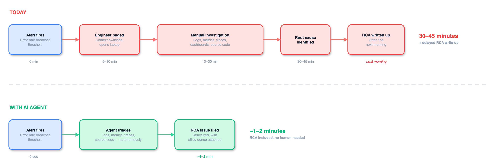
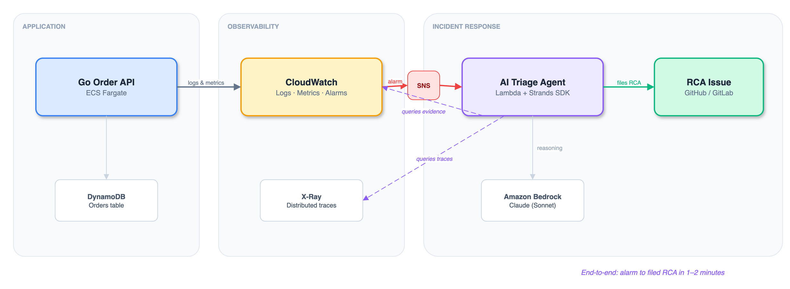
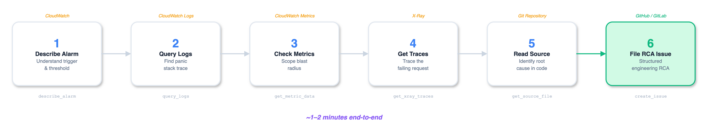

<!-- _class: lead -->

# AI-Powered Incident Response

## From Alert to Root Cause — Autonomously

AWS-native · Serverless · Built with Strands Agents + Amazon Bedrock

<!--
Speaker notes:
This is a working demo, not slides-ware. Everything you'll see runs on real AWS infrastructure.
The goal: show that structured triage — the 30-minute tax on every incident — is automatable today.
-->

---

# What If Triage Took Seconds, Not Hours?

Triage is investigation, not invention — the steps are structured and repeatable.
If your on-call runbook fits on a page, **an agent can follow it**.

<!--
Speaker notes:
Let the diagram do the talking. The contrast speaks for itself.
Top row: the reality everyone in this room knows — 30-45 minutes of senior engineer time, RCA often written up the next morning with half the context lost.
Bottom row: same investigation, done autonomously in under a minute, with the RCA filed immediately and all evidence attached.
The key phrase: "investigation, not invention." Triage follows a structured process. That's what makes it automatable.
-->

---

# Architecture

**Fully AWS-native. Serverless. Event-driven.** Built entirely on services your clients likely already run — CloudWatch, Lambda, Bedrock. No third-party tooling required.

<!--
Speaker notes:
Walk through the flow left-to-right:
1. App fails → CloudWatch picks up the error spike via structured logs and metrics
2. Alarm breaches threshold (>10% error rate over 1 min) → SNS → Lambda
3. Agent uses Strands SDK to reason through the investigation: queries logs, metrics, X-Ray traces, reads the source code
4. Files a structured RCA issue with all evidence attached

Key sell for architects: everything here is IAC (Terraform), reproducible, and uses standard AWS integration patterns.
Key sell for skeptics: the agent uses the same data sources an engineer would. No magic — just automation of a structured process.
-->

---

# The Agent in Action

The agent follows the same playbook a senior engineer would — querying logs, scoping blast radius, tracing requests, reading the source — and files a structured RCA with all evidence attached.

Every step is **logged and auditable**. No black box.

<!--
Speaker notes:
This is NOT a chatbot answering questions. It's an autonomous agent that:
1. Receives the alarm payload
2. Decides which tools to call and in what order
3. Synthesises the evidence into a root-cause analysis
4. Files it as an actionable engineering issue

The whole process takes a minute or two. We'll see it live in the demo.

For the technically curious: the agent uses Strands Agents SDK (AWS open-source), runs as a container on Lambda, and calls Claude via Amazon Bedrock. Each tool call is a real AWS API call — describe_alarm, query_logs, get_metric_data, etc.
-->

---

# Governance & Security

The question isn't *"can AI do this?"* — it's *"should we trust it to?"*

### Built for trust
- Every agent action logged to CloudWatch
- Full audit trail — see exactly why it reached each conclusion
- Agent **files an issue, never deploys a fix**
- Human remains the decision-maker

### Built on AWS guardrails
- Amazon Bedrock — IAM-controlled, no API keys to manage
- Least-privilege IAM roles per component
- Private subnets; only the ALB is internet-facing

AI as the investigator. Human as the decision-maker.

<!--
Speaker notes:
This slide is for the skeptics in the room — and there should be skeptics.
Key points:
- The agent is READ-ONLY on your infrastructure. It queries observability data. It does not modify anything.
- It files an issue. A human decides what to do about it.
- No data leaves the AWS account — Bedrock runs within your account boundary.
- Every tool invocation is logged, so you can audit exactly what the agent saw and why it reached its conclusion.

For clients in regulated industries: this is the right entry point for AI in operations — low risk, high visibility, auditable, and human-in-the-loop.
-->

---

<!-- _class: lead -->

# Taking It Further

### For clients
- Bolt-on to any AWS environment with CloudWatch
- Customise to their stack — PagerDuty, Datadog, Jira, ServiceNow
- Natural extension of managed services engagements
- Low-risk AI entry point for regulated industries

### What's next
- Runbook automation beyond incident response
- Multi-cloud observability (Azure Monitor, GCP Cloud Ops)
- Integration with existing ITSM workflows

Live demo follows — let's break something.

<!--
Speaker notes:
Two angles here:
1. For the commercial-minded: this is a repeatable accelerator. Every client with AWS and an on-call team is a potential engagement. We're not selling AI — we're selling faster incident response with full auditability.

Transition to the live demo. Explain what they'll see: real traffic, a real bug, a real alarm, and the agent triaging it autonomously.
-->
